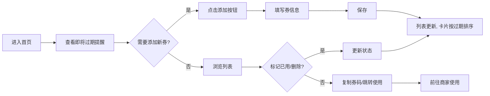

# 羊毛管家 - 优惠券管理工具 PRD

## 1. Product Overview
- 一个面向频繁抢券用户的优惠券管理工具，解决优惠券到期遗忘的核心痛点。用户可以快速录入抢到的各种免单券、优惠券，系统按到期时间自动排序并提醒。
- 目标用户：热爱薅羊毛、经常抢各类优惠券但容易过期忘记使用的用户群体。

## 2. Core Features

### 2.1 Feature Module
1. **首页仪表盘**: 展示即将过期提醒、优惠券总览、分类统计
2. **券列表页**: 查看所有优惠券卡片，支持按状态筛选和按平台搜索
3. **添加/编辑券**: 录入券信息（名称、平台、金额、券码、过期日期、标签等）
4. **标记已用/删除**: 管理券的状态变更
5. **本地持久化**: 数据保存在浏览器 localStorage，刷新不丢失

### 2.3 Page Details

| Page Name | Module Name | Feature description |
|-----------|-------------|---------------------|
| 首页仪表盘 | 即将过期卡片 | 按剩余天数从近到远排序，高亮显示3天内即将过期的券 |
| 首页仪表盘 | 分类统计 | 显示总券数、即将过期、已使用、已过期的统计数字 |
| 券列表页 | 卡片列表 | 卡片展示券名称、平台、金额、剩余天数、券码快捷复制 |
| 券列表页 | 筛选/搜索 | 支持按状态（全部/未使用/已使用/已过期）筛选，按关键词搜索 |
| 添加/编辑券 | 表单 | 包含：券名称、平台/商家、券码/链接、面额、过期日期、标签、备注 |

## 3. Core Process

## 4. User Interface Design

### 4.1 Design Style
- **主色调**: 奶油米白背景 + 暖橙（#FF6B35）主色 + 薄荷绿（#2EC4B6）辅助色 + 警报红（#E71D36）提醒色
- **设计方向**: 温暖、活泼、卡片感强 —— 让人觉得省钱是一件快乐的事
- **字体**: 标题使用 Playfair Display (展示类衬线) + 正文使用 Space Mono (等宽字体带来独特个性)
- **卡片**: 大量使用圆角卡片（rounded-2xl），带柔和阴影，悬停时轻微上浮
- **布局**: 顶部导航 + 主内容区卡片瀑布流，桌面双栏，移动端单栏
- **视觉核心**: 每张优惠券以卡券形式展示，左右两端有半圆缺口（典型优惠券样式），虚线边缘区分不同券种

### 4.2 Page Design Overview

| Page Name | Module Name | UI Elements |
|-----------|-------------|-------------|
| 首页仪表盘 | Hero 区 | 大号标题 "你的羊毛管家 🐑" + 4 个统计胶囊 + 渐变背景光晕 |
| 首页仪表盘 | 即将过期卡片 | 横向滚动卡片组，显示券名、平台、金额、剩余天数徽章，红色边框强调 |
| 券列表页 | 券卡片 | 卡券样式（左右半圆缺口），平台标签、金额醒目，剩余天数徽章 |
| 添加/编辑券 | 弹窗表单 | 半透明蒙层 + 圆角卡片表单，标签页风格输入项 |
| 全局 | 顶部导航 | 固定顶部，毛玻璃效果，含 Logo + 标题 + "添加券"按钮 |

### 4.3 Responsiveness
- 桌面端 (≥1024px): 2~3 列卡片网格
- 平板端 (768px-1024px): 2 列卡片网格
- 移动端 (<768px): 单列滚动，导航栏简化为汉堡菜单
