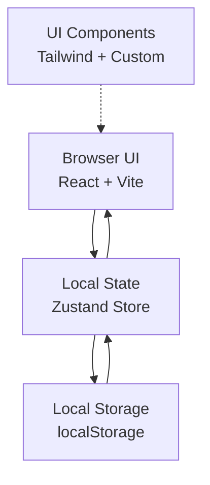

# 羊毛管家 - 技术架构

## 1. Architecture Design



## 2. Technology Description
- **Frontend**: React@18 + TypeScript + Vite
- **Styling**: Tailwind CSS 3.x
- **State Management**: Zustand（轻量级，优惠券数量数据量小够用）
- **Persistence**: localStorage（纯前端，无需后端）
- **Backend**: None（纯前端应用，数据本地存储）
- **Icons**: lucide-react

## 3. Route Definitions

| Route | Purpose |
|-------|---------|
| / | 首页仪表盘 + 券列表（单页应用，全部在此页内切换视图） |

## 4. Data Model

### 4.1 Coupon Entity
```typescript
type CouponStatus = 'unused' | 'used' | 'expired';

interface Coupon {
  id: string;              // UUID
  name: string;            // 券名称，如 "瑞幸咖啡免单券"
  platform: string;        // 平台/商家，如 "瑞幸"
  code?: string;           // 券码/兑换码
  url?: string;            // 使用链接
  amount?: string;         // 面额/折扣描述，如 "¥30" 或 "5折"
  expiryDate: string;      // 过期日期 YYYY-MM-DD
  tags?: string[];         // 标签，如 ["餐饮", "免单"]
  note?: string;           // 备注
  status: CouponStatus;    // unused | used | expired
  createdAt: string;       // 创建时间
  updatedAt: string;       // 更新时间
}
```

### 4.2 Storage Key
- `wool-coupons`: 优惠券列表 JSON 字符串

## 5. File Structure

```
src/
├── main.tsx              # 入口
├── App.tsx               # 主应用，组装各模块
├── index.css             # 全局样式 + Tailwind
├── store/
│   └── couponStore.ts    # Zustand store，管理优惠券 CRUD
├── components/
│   ├── NavBar.tsx        # 顶部导航
│   ├── HeroSection.tsx   # 首页 Hero + 统计数据
│   ├── CouponCard.tsx    # 优惠券卡片（带券形样式）
│   ├── CouponList.tsx    # 列表 + 筛选 + 搜索
│   ├── CouponModal.tsx   # 添加/编辑表单弹窗
│   ├── EmptyState.tsx    # 空状态插画
│   └── StatsPill.tsx     # 统计胶囊
├── utils/
│   ├── date.ts           # 日期工具：计算剩余天数、判断过期
│   └── storage.ts        # localStorage 读写封装
└── types/
    └── coupon.ts         # TypeScript 类型定义
```

## 6. Core Logic Notes

### 6.1 过期状态计算
- 每次读取列表时，对每个 unused 券检查：`expiryDate < today` → 自动置为 `expired`
- 剩余天数：`Math.ceil((expiryDate - today) / 86400000)`
- 即将过期：剩余天数 ≤ 3

### 6.2 排序逻辑
- 未使用券：按过期日期升序（越近越靠前）
- 已使用券：按更新日期降序
- 已过期券：按过期日期降序

### 6.3 localStorage 封装
- 提供 `loadCoupons()` / `saveCoupons(coupons)` 函数
- 每次写入前 JSON.stringify，读取后 JSON.parse，并做类型兜底
- 读写失败时返回默认空数组，保证应用不崩溃
